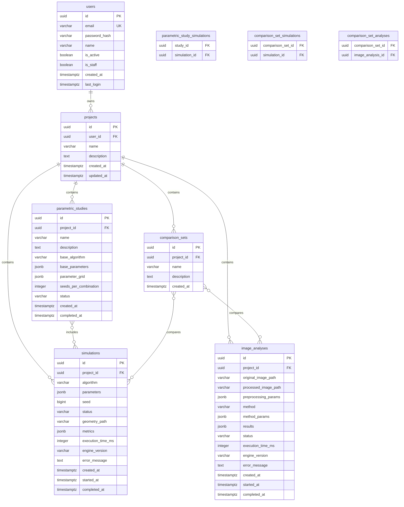

# Database Schema - pyAgloGen3D

## Overview

PostgreSQL 16+ con soporte para:
- **JSONB**: Parametros flexibles por algoritmo/metodo
- **ArrayField**: Series numericas cortas
- **UUID**: Primary keys para evitar colisiones
- **Timestamps**: Auditoria completa

---

## Entity Relationship Diagram



---

## Table Definitions

### users

```sql
CREATE TABLE users (
    id UUID PRIMARY KEY DEFAULT gen_random_uuid(),
    email VARCHAR(255) NOT NULL UNIQUE,
    password_hash VARCHAR(255) NOT NULL,
    name VARCHAR(100),
    is_active BOOLEAN NOT NULL DEFAULT TRUE,
    is_staff BOOLEAN NOT NULL DEFAULT FALSE,
    created_at TIMESTAMPTZ NOT NULL DEFAULT NOW(),
    last_login TIMESTAMPTZ
);

CREATE INDEX idx_users_email ON users(email);
CREATE INDEX idx_users_is_active ON users(is_active) WHERE is_active = TRUE;
```

### projects

```sql
CREATE TABLE projects (
    id UUID PRIMARY KEY DEFAULT gen_random_uuid(),
    user_id UUID NOT NULL REFERENCES users(id) ON DELETE CASCADE,
    name VARCHAR(255) NOT NULL,
    description TEXT,
    created_at TIMESTAMPTZ NOT NULL DEFAULT NOW(),
    updated_at TIMESTAMPTZ NOT NULL DEFAULT NOW()
);

CREATE INDEX idx_projects_user_id ON projects(user_id);
CREATE INDEX idx_projects_created_at ON projects(created_at DESC);

-- Trigger para updated_at
CREATE OR REPLACE FUNCTION update_updated_at_column()
RETURNS TRIGGER AS $$
BEGIN
    NEW.updated_at = NOW();
    RETURN NEW;
END;
$$ language 'plpgsql';

CREATE TRIGGER update_projects_updated_at
    BEFORE UPDATE ON projects
    FOR EACH ROW
    EXECUTE FUNCTION update_updated_at_column();
```

### simulations

```sql
CREATE TYPE simulation_algorithm AS ENUM ('dla', 'cca', 'ballistic', 'tunable');
CREATE TYPE simulation_status AS ENUM ('queued', 'running', 'completed', 'failed', 'cancelled');

CREATE TABLE simulations (
    id UUID PRIMARY KEY DEFAULT gen_random_uuid(),
    project_id UUID NOT NULL REFERENCES projects(id) ON DELETE CASCADE,
    algorithm simulation_algorithm NOT NULL,
    parameters JSONB NOT NULL,
    seed BIGINT NOT NULL,
    status simulation_status NOT NULL DEFAULT 'queued',
    geometry_path VARCHAR(512),
    metrics JSONB,
    execution_time_ms INTEGER,
    engine_version VARCHAR(20),
    error_message TEXT,
    created_at TIMESTAMPTZ NOT NULL DEFAULT NOW(),
    started_at TIMESTAMPTZ,
    completed_at TIMESTAMPTZ,

    -- Constraints
    CONSTRAINT valid_seed CHECK (seed >= 0),
    CONSTRAINT valid_execution_time CHECK (execution_time_ms IS NULL OR execution_time_ms >= 0)
);

-- Indexes for common queries
CREATE INDEX idx_simulations_project_id ON simulations(project_id);
CREATE INDEX idx_simulations_status ON simulations(status);
CREATE INDEX idx_simulations_algorithm ON simulations(algorithm);
CREATE INDEX idx_simulations_created_at ON simulations(created_at DESC);

-- GIN index for JSONB queries
CREATE INDEX idx_simulations_parameters ON simulations USING GIN (parameters);
CREATE INDEX idx_simulations_metrics ON simulations USING GIN (metrics);

-- Partial index for active simulations
CREATE INDEX idx_simulations_queued_running ON simulations(created_at)
    WHERE status IN ('queued', 'running');

-- Index for fractal dimension queries
CREATE INDEX idx_simulations_fractal_dimension ON simulations(
    (metrics->>'fractal_dimension')::FLOAT
) WHERE metrics IS NOT NULL;
```

### image_analyses

```sql
CREATE TYPE fractal_method AS ENUM (
    'box_counting', 'sandbox', 'correlation', 'lacunarity', 'multifractal'
);
CREATE TYPE analysis_status AS ENUM ('queued', 'running', 'completed', 'failed', 'cancelled');

CREATE TABLE image_analyses (
    id UUID PRIMARY KEY DEFAULT gen_random_uuid(),
    project_id UUID NOT NULL REFERENCES projects(id) ON DELETE CASCADE,
    original_image_path VARCHAR(512) NOT NULL,
    processed_image_path VARCHAR(512),
    preprocessing_params JSONB NOT NULL,
    method fractal_method NOT NULL,
    method_params JSONB,
    results JSONB,
    status analysis_status NOT NULL DEFAULT 'queued',
    execution_time_ms INTEGER,
    engine_version VARCHAR(20),
    error_message TEXT,
    created_at TIMESTAMPTZ NOT NULL DEFAULT NOW(),
    started_at TIMESTAMPTZ,
    completed_at TIMESTAMPTZ,

    CONSTRAINT valid_execution_time CHECK (execution_time_ms IS NULL OR execution_time_ms >= 0)
);

CREATE INDEX idx_analyses_project_id ON image_analyses(project_id);
CREATE INDEX idx_analyses_status ON image_analyses(status);
CREATE INDEX idx_analyses_method ON image_analyses(method);
CREATE INDEX idx_analyses_created_at ON image_analyses(created_at DESC);

CREATE INDEX idx_analyses_preprocessing ON image_analyses USING GIN (preprocessing_params);
CREATE INDEX idx_analyses_results ON image_analyses USING GIN (results);
```

### parametric_studies

```sql
CREATE TYPE study_status AS ENUM ('pending', 'running', 'completed', 'failed', 'cancelled');

CREATE TABLE parametric_studies (
    id UUID PRIMARY KEY DEFAULT gen_random_uuid(),
    project_id UUID NOT NULL REFERENCES projects(id) ON DELETE CASCADE,
    name VARCHAR(255) NOT NULL,
    description TEXT,
    base_algorithm simulation_algorithm NOT NULL,
    base_parameters JSONB NOT NULL,
    parameter_grid JSONB NOT NULL,
    seeds_per_combination INTEGER NOT NULL DEFAULT 1,
    status study_status NOT NULL DEFAULT 'pending',
    created_at TIMESTAMPTZ NOT NULL DEFAULT NOW(),
    completed_at TIMESTAMPTZ,

    CONSTRAINT valid_seeds_per_combination CHECK (seeds_per_combination >= 1 AND seeds_per_combination <= 100)
);

CREATE TABLE parametric_study_simulations (
    study_id UUID NOT NULL REFERENCES parametric_studies(id) ON DELETE CASCADE,
    simulation_id UUID NOT NULL REFERENCES simulations(id) ON DELETE CASCADE,
    PRIMARY KEY (study_id, simulation_id)
);

CREATE INDEX idx_studies_project_id ON parametric_studies(project_id);
CREATE INDEX idx_studies_status ON parametric_studies(status);
CREATE INDEX idx_study_sims_study_id ON parametric_study_simulations(study_id);
CREATE INDEX idx_study_sims_simulation_id ON parametric_study_simulations(simulation_id);
```

### comparison_sets

```sql
CREATE TABLE comparison_sets (
    id UUID PRIMARY KEY DEFAULT gen_random_uuid(),
    project_id UUID NOT NULL REFERENCES projects(id) ON DELETE CASCADE,
    name VARCHAR(255) NOT NULL,
    description TEXT,
    created_at TIMESTAMPTZ NOT NULL DEFAULT NOW()
);

CREATE TABLE comparison_set_simulations (
    comparison_set_id UUID NOT NULL REFERENCES comparison_sets(id) ON DELETE CASCADE,
    simulation_id UUID NOT NULL REFERENCES simulations(id) ON DELETE CASCADE,
    PRIMARY KEY (comparison_set_id, simulation_id)
);

CREATE TABLE comparison_set_analyses (
    comparison_set_id UUID NOT NULL REFERENCES comparison_sets(id) ON DELETE CASCADE,
    image_analysis_id UUID NOT NULL REFERENCES image_analyses(id) ON DELETE CASCADE,
    PRIMARY KEY (comparison_set_id, image_analysis_id)
);

CREATE INDEX idx_comparison_sets_project_id ON comparison_sets(project_id);
```

---

## JSONB Schemas

### DLA Parameters

```json
{
  "$schema": "http://json-schema.org/draft-07/schema#",
  "type": "object",
  "required": ["n_particles"],
  "properties": {
    "n_particles": {
      "type": "integer",
      "minimum": 10,
      "maximum": 100000
    },
    "sticking_probability": {
      "type": "number",
      "minimum": 0.0,
      "maximum": 1.0,
      "default": 1.0
    },
    "lattice_size": {
      "type": "integer",
      "minimum": 50,
      "maximum": 2000,
      "default": 200
    },
    "seed_radius": {
      "type": "number",
      "minimum": 0.1,
      "maximum": 10.0,
      "default": 1.0
    }
  }
}
```

### CCA Parameters

```json
{
  "$schema": "http://json-schema.org/draft-07/schema#",
  "type": "object",
  "required": ["n_particles", "initial_clusters"],
  "properties": {
    "n_particles": {
      "type": "integer",
      "minimum": 10,
      "maximum": 100000
    },
    "initial_clusters": {
      "type": "integer",
      "minimum": 2,
      "maximum": 1000
    },
    "interaction_radius": {
      "type": "number",
      "minimum": 1.0,
      "maximum": 10.0,
      "default": 2.5
    },
    "concentration": {
      "type": "number",
      "minimum": 0.001,
      "maximum": 0.5,
      "default": 0.01
    }
  }
}
```

### Simulation Metrics

```json
{
  "$schema": "http://json-schema.org/draft-07/schema#",
  "type": "object",
  "required": ["fractal_dimension", "prefactor", "radius_of_gyration"],
  "properties": {
    "fractal_dimension": {
      "type": "number",
      "minimum": 1.0,
      "maximum": 3.0
    },
    "fractal_dimension_std": {
      "type": "number",
      "minimum": 0.0
    },
    "prefactor": {
      "type": "number",
      "minimum": 0.0
    },
    "radius_of_gyration": {
      "type": "number",
      "minimum": 0.0
    },
    "porosity": {
      "type": "number",
      "minimum": 0.0,
      "maximum": 1.0
    },
    "coordination": {
      "type": "object",
      "properties": {
        "mean": { "type": "number" },
        "std": { "type": "number" },
        "histogram": {
          "type": "array",
          "items": { "type": "integer" }
        }
      }
    },
    "rdf": {
      "type": "object",
      "properties": {
        "r": { "type": "array", "items": { "type": "number" } },
        "g_r": { "type": "array", "items": { "type": "number" } }
      }
    },
    "rg_evolution": {
      "type": "object",
      "properties": {
        "n": { "type": "array", "items": { "type": "integer" } },
        "rg": { "type": "array", "items": { "type": "number" } }
      }
    }
  }
}
```

### Preprocessing Parameters

```json
{
  "$schema": "http://json-schema.org/draft-07/schema#",
  "type": "object",
  "required": ["threshold_method"],
  "properties": {
    "threshold_method": {
      "type": "string",
      "enum": ["otsu", "manual", "adaptive", "isodata"]
    },
    "threshold_value": {
      "type": "integer",
      "minimum": 0,
      "maximum": 255
    },
    "invert": {
      "type": "boolean",
      "default": false
    },
    "remove_small_objects": {
      "type": "integer",
      "minimum": 0,
      "default": 0
    },
    "fill_holes": {
      "type": "boolean",
      "default": false
    },
    "gaussian_blur_sigma": {
      "type": "number",
      "minimum": 0.0,
      "default": 0.0
    }
  }
}
```

### Box Counting Results

```json
{
  "$schema": "http://json-schema.org/draft-07/schema#",
  "type": "object",
  "required": ["fractal_dimension", "r_squared", "log_sizes", "log_counts"],
  "properties": {
    "fractal_dimension": {
      "type": "number",
      "minimum": 0.0,
      "maximum": 2.0
    },
    "r_squared": {
      "type": "number",
      "minimum": 0.0,
      "maximum": 1.0
    },
    "std_error": {
      "type": "number",
      "minimum": 0.0
    },
    "confidence_interval_95": {
      "type": "array",
      "items": { "type": "number" },
      "minItems": 2,
      "maxItems": 2
    },
    "log_sizes": {
      "type": "array",
      "items": { "type": "number" }
    },
    "log_counts": {
      "type": "array",
      "items": { "type": "number" }
    },
    "residuals": {
      "type": "array",
      "items": { "type": "number" }
    }
  }
}
```

### Multifractal Results

```json
{
  "$schema": "http://json-schema.org/draft-07/schema#",
  "type": "object",
  "required": ["q_values", "dq_spectrum"],
  "properties": {
    "q_values": {
      "type": "array",
      "items": { "type": "number" }
    },
    "dq_spectrum": {
      "type": "array",
      "items": { "type": "number" }
    },
    "tau_q": {
      "type": "array",
      "items": { "type": "number" }
    },
    "alpha": {
      "type": "array",
      "items": { "type": "number" }
    },
    "f_alpha": {
      "type": "array",
      "items": { "type": "number" }
    },
    "spectrum_width": {
      "type": "number"
    },
    "asymmetry": {
      "type": "number"
    }
  }
}
```

---

## Common Queries

### Get project with simulation stats

```sql
SELECT
    p.id,
    p.name,
    p.description,
    COUNT(DISTINCT s.id) AS simulation_count,
    COUNT(DISTINCT a.id) AS analysis_count,
    AVG((s.metrics->>'fractal_dimension')::FLOAT) AS avg_df,
    p.created_at,
    p.updated_at
FROM projects p
LEFT JOIN simulations s ON s.project_id = p.id AND s.status = 'completed'
LEFT JOIN image_analyses a ON a.project_id = p.id AND a.status = 'completed'
WHERE p.user_id = $1
GROUP BY p.id
ORDER BY p.updated_at DESC;
```

### Filter simulations by Df range

```sql
SELECT *
FROM simulations
WHERE project_id = $1
  AND status = 'completed'
  AND (metrics->>'fractal_dimension')::FLOAT BETWEEN $2 AND $3
ORDER BY created_at DESC
LIMIT $4 OFFSET $5;
```

### Get parametric study results

```sql
SELECT
    s.parameters,
    AVG((s.metrics->>'fractal_dimension')::FLOAT) AS df_mean,
    STDDEV((s.metrics->>'fractal_dimension')::FLOAT) AS df_std,
    AVG((s.metrics->>'prefactor')::FLOAT) AS kf_mean,
    STDDEV((s.metrics->>'prefactor')::FLOAT) AS kf_std,
    COUNT(*) AS n_runs
FROM parametric_study_simulations pss
JOIN simulations s ON s.id = pss.simulation_id
WHERE pss.study_id = $1
  AND s.status = 'completed'
GROUP BY s.parameters
ORDER BY s.parameters;
```

### Queue statistics

```sql
SELECT
    status,
    algorithm,
    COUNT(*) AS count,
    AVG(execution_time_ms) AS avg_time_ms,
    MAX(created_at) AS most_recent
FROM simulations
WHERE created_at > NOW() - INTERVAL '24 hours'
GROUP BY status, algorithm
ORDER BY status, count DESC;
```

---

## Django Models

```python
# apps/simulations/models.py

from django.db import models
from django.contrib.postgres.fields import ArrayField
import uuid


class SimulationAlgorithm(models.TextChoices):
    DLA = 'dla', 'Diffusion-Limited Aggregation'
    CCA = 'cca', 'Cluster-Cluster Aggregation'
    BALLISTIC = 'ballistic', 'Ballistic Aggregation'
    TUNABLE = 'tunable', 'Tunable Sticking Probability'


class SimulationStatus(models.TextChoices):
    QUEUED = 'queued', 'Queued'
    RUNNING = 'running', 'Running'
    COMPLETED = 'completed', 'Completed'
    FAILED = 'failed', 'Failed'
    CANCELLED = 'cancelled', 'Cancelled'


class Simulation(models.Model):
    id = models.UUIDField(primary_key=True, default=uuid.uuid4, editable=False)
    project = models.ForeignKey(
        'projects.Project',
        on_delete=models.CASCADE,
        related_name='simulations'
    )
    algorithm = models.CharField(
        max_length=20,
        choices=SimulationAlgorithm.choices
    )
    parameters = models.JSONField()
    seed = models.BigIntegerField()
    status = models.CharField(
        max_length=20,
        choices=SimulationStatus.choices,
        default=SimulationStatus.QUEUED
    )
    geometry_path = models.CharField(max_length=512, blank=True)
    metrics = models.JSONField(null=True, blank=True)
    execution_time_ms = models.PositiveIntegerField(null=True, blank=True)
    engine_version = models.CharField(max_length=20, blank=True)
    error_message = models.TextField(blank=True)
    created_at = models.DateTimeField(auto_now_add=True)
    started_at = models.DateTimeField(null=True, blank=True)
    completed_at = models.DateTimeField(null=True, blank=True)

    class Meta:
        db_table = 'simulations'
        ordering = ['-created_at']
        indexes = [
            models.Index(fields=['project', '-created_at']),
            models.Index(fields=['status']),
            models.Index(fields=['algorithm']),
        ]

    def __str__(self):
        return f"{self.algorithm} - {self.status} ({self.id})"
```

```python
# apps/fractal_analysis/models.py

class FractalMethod(models.TextChoices):
    BOX_COUNTING = 'box_counting', 'Box-Counting'
    SANDBOX = 'sandbox', 'Sandbox Method'
    CORRELATION = 'correlation', 'Correlation Dimension'
    LACUNARITY = 'lacunarity', 'Lacunarity'
    MULTIFRACTAL = 'multifractal', 'Multifractal Dq'


class AnalysisStatus(models.TextChoices):
    QUEUED = 'queued', 'Queued'
    RUNNING = 'running', 'Running'
    COMPLETED = 'completed', 'Completed'
    FAILED = 'failed', 'Failed'
    CANCELLED = 'cancelled', 'Cancelled'


class ImageAnalysis(models.Model):
    id = models.UUIDField(primary_key=True, default=uuid.uuid4, editable=False)
    project = models.ForeignKey(
        'projects.Project',
        on_delete=models.CASCADE,
        related_name='analyses'
    )
    original_image_path = models.CharField(max_length=512)
    processed_image_path = models.CharField(max_length=512, blank=True)
    preprocessing_params = models.JSONField()
    method = models.CharField(max_length=20, choices=FractalMethod.choices)
    method_params = models.JSONField(null=True, blank=True)
    results = models.JSONField(null=True, blank=True)
    status = models.CharField(
        max_length=20,
        choices=AnalysisStatus.choices,
        default=AnalysisStatus.QUEUED
    )
    execution_time_ms = models.PositiveIntegerField(null=True, blank=True)
    engine_version = models.CharField(max_length=20, blank=True)
    error_message = models.TextField(blank=True)
    created_at = models.DateTimeField(auto_now_add=True)
    started_at = models.DateTimeField(null=True, blank=True)
    completed_at = models.DateTimeField(null=True, blank=True)

    class Meta:
        db_table = 'image_analyses'
        ordering = ['-created_at']
        verbose_name_plural = 'Image analyses'
```

---

## Migrations Strategy

1. **Initial migration**: Create all tables with constraints
2. **Data seeding**: Demo projects and simulations for development
3. **Indexes**: Create after initial data load for large datasets
4. **JSONB validation**: Add CHECK constraints via raw SQL for schema validation

```python
# migrations/0002_add_jsonb_validation.py

from django.db import migrations

class Migration(migrations.Migration):
    dependencies = [
        ('simulations', '0001_initial'),
    ]

    operations = [
        migrations.RunSQL(
            # Add JSON schema validation function
            """
            CREATE OR REPLACE FUNCTION validate_dla_params(params JSONB)
            RETURNS BOOLEAN AS $$
            BEGIN
                RETURN (
                    params ? 'n_particles' AND
                    (params->>'n_particles')::INT >= 10 AND
                    (params->>'n_particles')::INT <= 100000
                );
            END;
            $$ LANGUAGE plpgsql IMMUTABLE;
            """,
            reverse_sql="DROP FUNCTION IF EXISTS validate_dla_params;"
        ),
    ]
```
