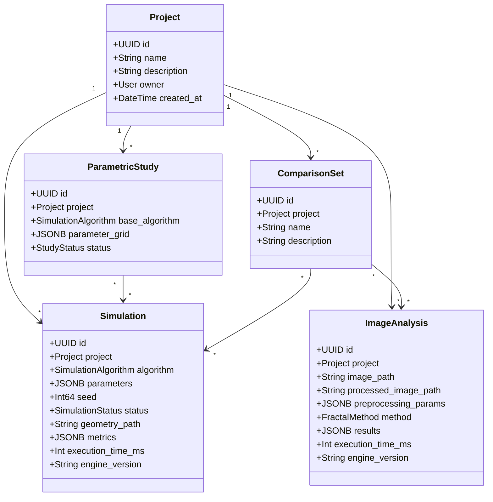
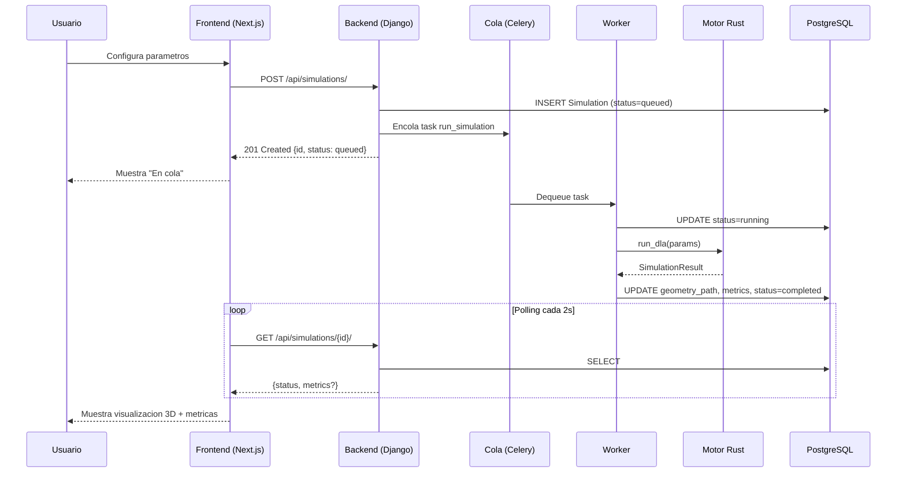
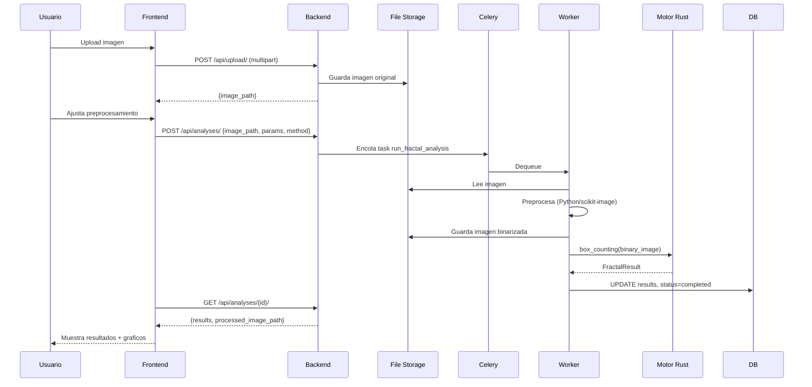
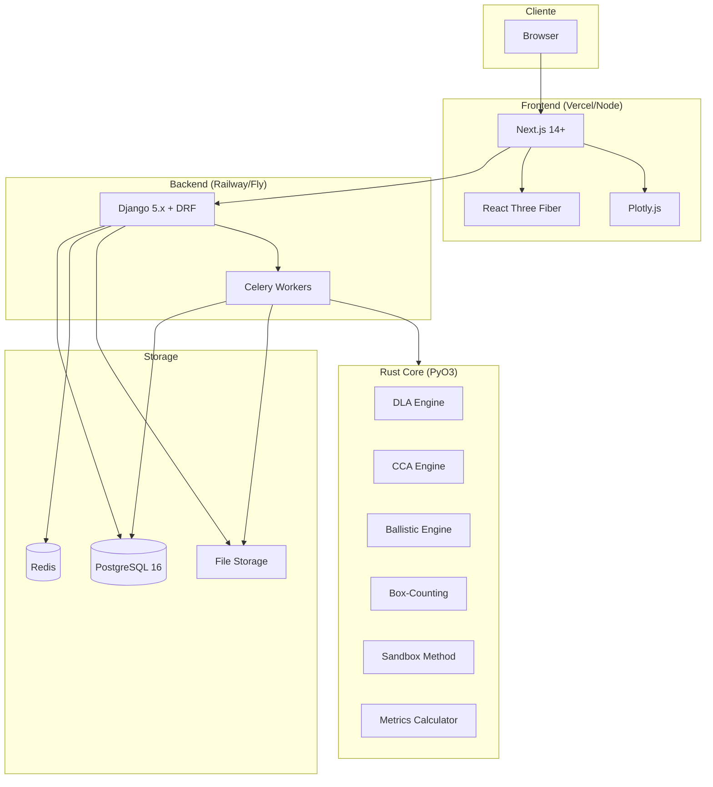
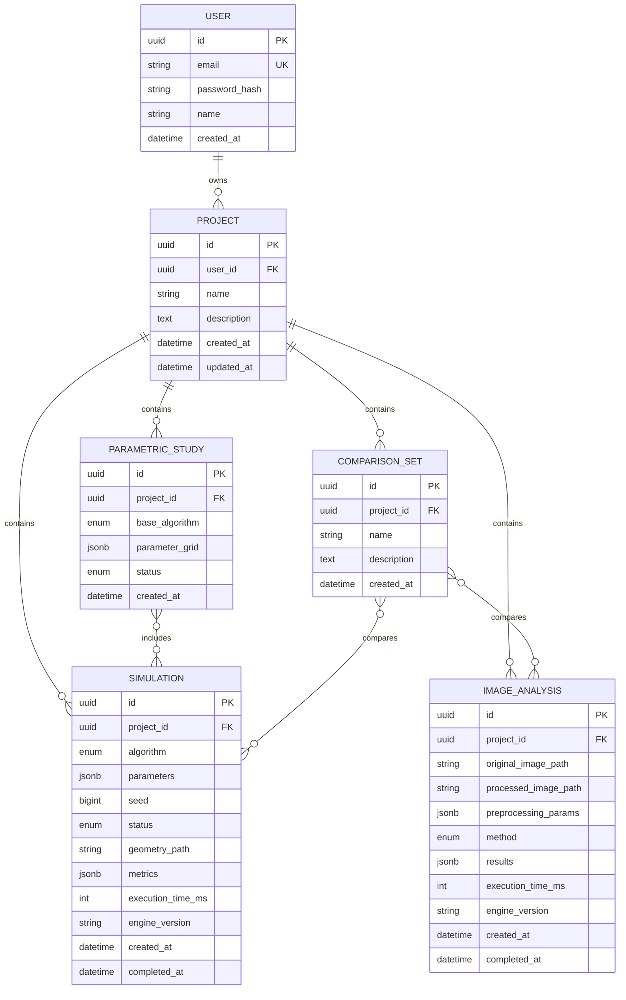
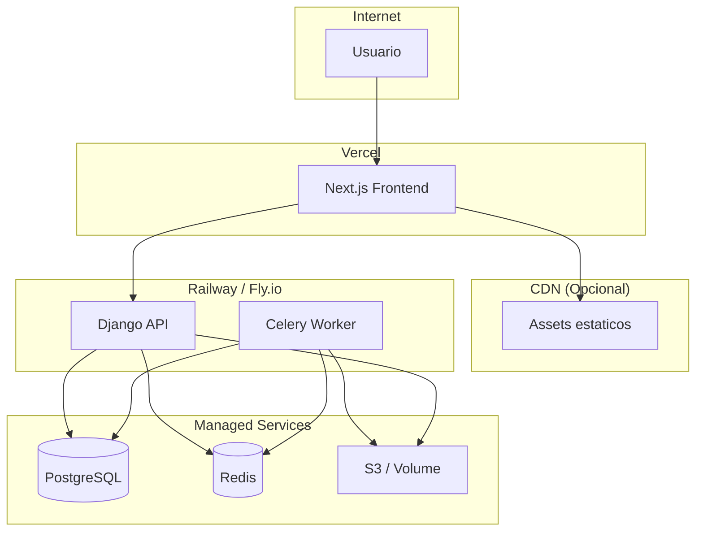
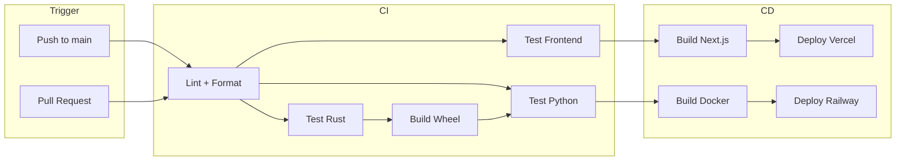
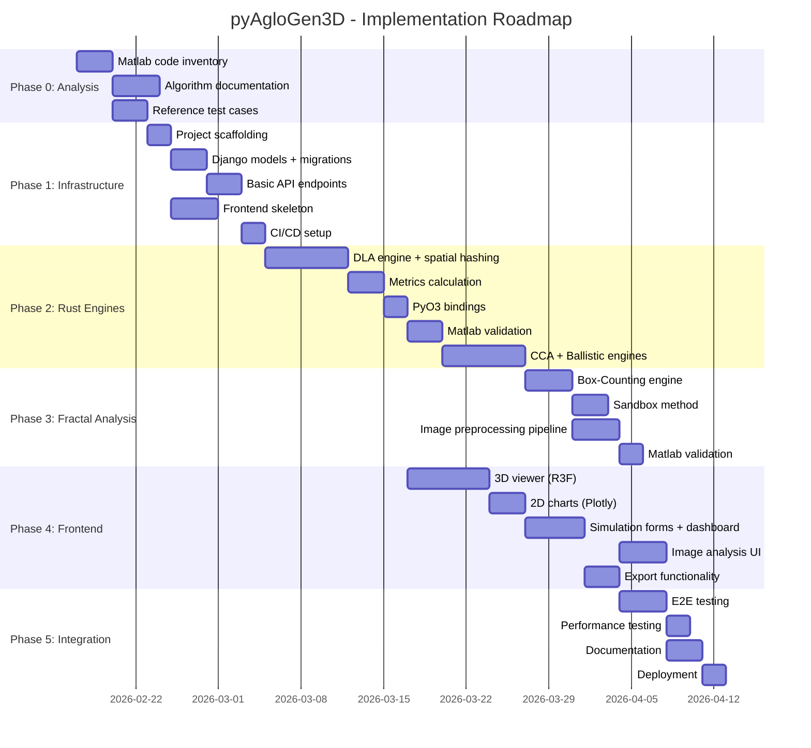

# Software Design Document: pyAgloGen3D

| Campo | Valor |
|-------|-------|
| **Version** | 1.0.0 |
| **Fecha** | 2026-02-17 |
| **Autor** | Juanjo |
| **Estado** | Draft |

---

## 1. Executive Summary

**pyAgloGen3D** es una plataforma cientifica-tecnica que unifica y moderniza dos herramientas de investigacion desarrolladas originalmente en Matlab durante una Tesis Doctoral: (1) **AgloGen3D**, un simulador de generacion de aglomerados tridimensionales mediante algoritmos de agregacion (DLA, Cluster-Cluster, Ballistic), y (2) **fraktal**, una herramienta de analisis fractal de imagenes 2D.

La arquitectura hibrida **Python + Rust** maximiza tanto la productividad de desarrollo (Django para API/persistencia) como el rendimiento computacional (Rust para motores de simulacion y analisis fractal). El frontend **Next.js con React Three Fiber** proporciona visualizacion 3D interactiva de calidad investigacion, mientras que **PostgreSQL** persiste completamente todos los parametros, geometrias y resultados para garantizar reproducibilidad cientifica total.

El MVP se enfoca en migrar fielmente los algoritmos del codigo Matlab original con mejoras de arquitectura, proporcionando una interfaz web moderna que elimina la dependencia de licencias Matlab y permite acceso colaborativo. El modelo de despliegue inicial es single-user local con vision de expansion a SaaS academico.

---

## 2. Problem Definition & Scope

### 2.1 Que estamos construyendo

Una plataforma web de simulacion y analisis fractal que comprende:

1. **Motor de Simulacion 3D**: Generacion de aglomerados de particulas mediante algoritmos de agregacion (DLA, CCA, Ballistic) con calculo automatico de propiedades fractales (Df, kf, Rg, RDF, porosidad, coordinacion).

2. **Motor de Analisis Fractal 2D**: Procesamiento de imagenes de microscopia/fotografia para determinar dimensiones fractales mediante multiples metodos (Box-Counting, Sandbox, Correlation, Lacunarity, Multifractal).

3. **Visualizador 3D Interactivo**: Renderizado WebGL de aglomerados con navegacion orbital, coloreado configurable, cortes, animacion de crecimiento y exportacion multi-formato.

4. **Sistema de Gestion de Experimentos**: Organizacion por proyectos, estudios parametricos, comparacion cruzada simulacion-imagen, y exportacion para publicaciones.

### 2.2 Para quien

| Perfil | Necesidades Clave |
|--------|-------------------|
| **Investigador academico** | Reproducibilidad total, barridos parametricos, exportacion LaTeX |
| **Doctorando/Masterando** | Interfaz intuitiva sin Matlab, figuras de calidad publicacion |
| **Profesor universitario** | Acceso web para practicas, sin instalacion local |
| **Ingeniero de materiales** | Analisis de microscopia, simulaciones de referencia |
| **El autor (Juanjo)** | Retomar investigacion, plataforma extensible y publicable |

### 2.3 Que problema resuelve

1. **Dependencia de Matlab**: El codigo original requiere licencias costosas y no es portable.
2. **Fragmentacion**: AgloGen3D y fraktal son herramientas separadas sin integracion.
3. **Reproducibilidad limitada**: Sin persistencia sistematica de parametros y resultados.
4. **Visualizacion estatica**: Matlab limita la interactividad y accesibilidad de visualizaciones.
5. **Rendimiento**: Matlab es lento para simulaciones grandes (>10.000 particulas).
6. **Colaboracion**: Archivos locales dificultan compartir resultados entre investigadores.

### 2.4 Modelo de dominio



### 2.5 Definicion de MVP (MoSCoW)

#### Must Have (MVP)
- [ ] Motor DLA con deteccion de colisiones eficiente (Rust)
- [ ] Motor CCA y Ballistic Aggregation (Rust)
- [ ] Calculo de metricas: Df, kf, Rg, RDF, coordinacion, porosidad
- [ ] Box-Counting y Sandbox Method para imagenes (Rust)
- [ ] Pipeline de preprocesamiento de imagen (binarizacion, limpieza)
- [ ] API REST (Django) para CRUD de proyectos, simulaciones, analisis
- [ ] Cola de tareas asincronas (Celery/Redis)
- [ ] Visor 3D con React Three Fiber (esferas, orbita, zoom, coloreado)
- [ ] Dashboard de simulaciones y analisis con filtros
- [ ] Graficos log-log, histogramas, RDF (Plotly)
- [ ] Persistencia completa en PostgreSQL (parametros, geometrias, resultados)
- [ ] Exportacion basica: CSV, PNG, STL

#### Should Have
- [ ] Correlation Dimension, Lacunarity, Multifractal (Rust)
- [ ] Estudios parametricos (barridos de parametros)
- [ ] Animacion de crecimiento de aglomerados
- [ ] Cortes y secciones interactivas en visor 3D
- [ ] Comparacion lado a lado de aglomerados
- [ ] Exportacion LaTeX para tablas
- [ ] Autenticacion de usuario (email/password)

#### Could Have
- [ ] WebSockets para progreso en tiempo real
- [ ] Estadisticas de ensemble (media, std de multiples runs)
- [ ] Exportacion OBJ, PLY, glTF
- [ ] Preprocesamiento avanzado con wizard paso a paso

#### Won't Have (Post-MVP)
- Propiedades opticas (T-matrix, DDA)
- Analisis fractal 3D volumetrico
- Machine Learning sobre datos de simulacion
- Multitenancy y SaaS

---

## 3. User Experience Design

### 3.1 User Stories

#### US-01: Ejecutar simulacion DLA
**Como** investigador
**Quiero** configurar y ejecutar una simulacion DLA con parametros personalizados
**Para** generar un aglomerado y analizar su dimension fractal

**Happy Flow:**
1. Usuario navega a Dashboard > Nueva Simulacion
2. Selecciona algoritmo "DLA"
3. Configura parametros: N=5000, sticking_prob=1.0, seed=42
4. Click "Ejecutar"
5. Sistema muestra estado "En cola" → "Ejecutando" → "Completada"
6. Usuario accede a vista de detalle con visualizacion 3D y metricas

**Alternative Flow - Parametros invalidos:**
3a. Usuario ingresa N=-100
3b. Sistema muestra error de validacion inline
3c. Usuario corrige y continua

**Error Flow - Fallo de simulacion:**
5a. Motor Rust reporta error (ej: memoria insuficiente)
5b. Sistema actualiza estado a "Error" con mensaje
5c. Usuario puede ver log de error y reintentar con otros parametros

#### US-02: Analizar imagen de microscopia
**Como** ingeniero de materiales
**Quiero** subir una imagen de microscopia y calcular su dimension fractal
**Para** caracterizar la morfologia de particulas reales

**Happy Flow:**
1. Usuario navega a Dashboard > Nuevo Analisis
2. Arrastra imagen PNG/TIFF al area de upload
3. Sistema muestra preview y opciones de preprocesamiento
4. Usuario ajusta umbral de binarizacion con slider (preview en vivo)
5. Selecciona metodo "Box-Counting"
6. Click "Analizar"
7. Sistema procesa y muestra: imagen binarizada, grafico log-log, Df, R2

**Alternative Flow - Imagen muy grande:**
2a. Usuario sube imagen de 8192x8192
2b. Sistema ofrece downsampling automatico a 4096x4096
2c. Usuario acepta y continua

#### US-03: Comparar simulacion con imagen real
**Como** doctorando
**Quiero** comparar la Df de mi simulacion con la de una imagen experimental
**Para** validar mi modelo de agregacion

**Happy Flow:**
1. Usuario tiene simulacion completada y analisis de imagen completado
2. Navega a Proyecto > Comparaciones > Nueva
3. Selecciona simulacion y analisis a comparar
4. Sistema genera vista comparativa: Df_sim vs Df_img, graficos superpuestos
5. Usuario exporta tabla comparativa en LaTeX

#### US-04: Estudio parametrico
**Como** investigador
**Quiero** ejecutar DLA con multiples combinaciones de N y sticking_prob
**Para** estudiar como afectan los parametros a la dimension fractal

**Happy Flow:**
1. Usuario navega a Estudios Parametricos > Nuevo
2. Selecciona algoritmo base "DLA"
3. Define grid: N=[100, 500, 1000, 5000], sticking_prob=[0.1, 0.5, 1.0]
4. Sistema calcula 12 combinaciones y muestra preview
5. Click "Lanzar Estudio"
6. Sistema encola 12 simulaciones independientes
7. Dashboard muestra progreso agregado y tabla de resultados

### 3.2 UI/UX Impact Assessment

| Area | Complejidad UI | Prioridad |
|------|---------------|-----------|
| Formulario de parametros DLA | Media | Alta |
| Visor 3D con controles | Alta | Alta |
| Upload y preview de imagen | Media | Alta |
| Dashboard con filtros y paginacion | Media | Alta |
| Slider de binarizacion con preview | Media | Media |
| Configurador de estudios parametricos | Alta | Media |
| Vista de comparacion cruzada | Media | Media |

### 3.3 Flujos de interaccion

#### Flujo de Simulacion



#### Flujo de Analisis de Imagen



---

## 4. Technical Architecture

### 4.1 System Overview



### 4.2 Data Model



### 4.3 Algoritmos y librerias clave

#### Algoritmos de Simulacion (Rust)

| Algoritmo | Complejidad | Tecnica de Optimizacion |
|-----------|-------------|-------------------------|
| **DLA** | O(N * steps * N_collision) | Octree/Spatial Hashing para colisiones |
| **CCA** | O(clusters^2 * particles) | Grid espacial para busqueda de vecinos |
| **Ballistic** | O(N * N_collision) | Ray-sphere intersection optimizado |

#### Algoritmos de Analisis Fractal (Rust)

| Metodo | Complejidad | Descripcion |
|--------|-------------|-------------|
| **Box-Counting** | O(scales * pixels) | Recorre imagen a multiples escalas |
| **Sandbox** | O(seeds * scales * pixels) | Circulos crecientes desde puntos semilla |
| **Correlation** | O(N^2) | Pares de puntos del objeto |
| **Lacunarity** | O(scales * pixels) | Sliding box multiescala |
| **Multifractal** | O(q * scales * pixels) | Box-counting generalizado |

#### Librerias Clave

**Rust (aglogen_core)**
- `pyo3`: Bindings Python
- `numpy`: Interoperabilidad con NumPy arrays
- `rand` + `rand_pcg`: PRNG determinista
- `rayon`: Paralelismo
- `nalgebra`: Algebra lineal
- `kiddo` o custom: Octree/KD-tree

**Python (backend)**
- `django` + `djangorestframework`: API
- `celery` + `redis`: Cola de tareas
- `numpy` + `scipy`: Post-procesamiento
- `scikit-image` + `pillow`: Preprocesamiento de imagen
- `maturin`: Build del modulo Rust

**TypeScript (frontend)**
- `@react-three/fiber` + `@react-three/drei`: 3D
- `plotly.js` + `react-plotly.js`: Graficos
- `@tanstack/react-query`: Server state
- `zustand`: Client state
- `tailwindcss` + `shadcn/ui`: UI

### 4.4 Patrones de diseno utilizados

| Patron | Aplicacion |
|--------|------------|
| **Repository** | Django ORM abstrae acceso a datos |
| **Service Layer** | `services.py` encapsula logica de negocio |
| **Task Queue** | Celery desacopla ejecucion larga del request |
| **Strategy** | Trait `SimulationEngine` en Rust para diferentes algoritmos |
| **Builder** | Configuracion de parametros de simulacion |
| **Observer** | Polling/WebSocket para notificar cambios de estado |

### 4.5 Dependencias de terceros

| Categoria | Dependencia | Version | Licencia | Riesgo |
|-----------|-------------|---------|----------|--------|
| Backend | Django | 5.x | BSD | Bajo |
| Backend | Celery | 5.x | BSD | Bajo |
| Backend | psycopg | 3.x | LGPL | Bajo |
| Rust | PyO3 | 0.20+ | Apache-2.0 | Bajo |
| Rust | Rayon | 1.x | Apache-2.0 | Bajo |
| Frontend | Next.js | 14+ | MIT | Bajo |
| Frontend | Three.js | 0.160+ | MIT | Bajo |
| Frontend | Plotly.js | 2.x | MIT | Bajo |

### 4.6 Edge cases y manejo de errores

| Escenario | Manejo |
|-----------|--------|
| Simulacion sin convergencia | Timeout configurable, guardar estado parcial |
| Imagen no binarizable | Mensaje de error con sugerencias de preprocesamiento |
| Memoria insuficiente (Rust) | Capturar panic, reportar error estructurado |
| Worker caido mid-task | Celery retry con backoff, estado `failed` |
| Upload de imagen corrupta | Validacion con Pillow, rechazo temprano |
| N > 50000 particulas | Warning al usuario, limite configurable |
| Seed no proporcionado | Generar seed aleatorio, persistir para reproducibilidad |

---

## 5. API Specification

### 5.1 Recursos REST

#### Projects

```
GET    /api/projects/              # Listar proyectos del usuario
POST   /api/projects/              # Crear proyecto
GET    /api/projects/{id}/         # Detalle de proyecto
PATCH  /api/projects/{id}/         # Actualizar proyecto
DELETE /api/projects/{id}/         # Eliminar proyecto (cascade)
```

#### Simulations

```
GET    /api/projects/{pid}/simulations/           # Listar simulaciones
POST   /api/projects/{pid}/simulations/           # Crear y encolar simulacion
GET    /api/projects/{pid}/simulations/{id}/      # Detalle + metricas
DELETE /api/projects/{pid}/simulations/{id}/      # Eliminar simulacion

GET    /api/simulations/{id}/geometry/            # Descargar geometria (NumPy binary)
GET    /api/simulations/{id}/export/{format}/     # Exportar (csv, stl, obj)
```

#### Image Analyses

```
POST   /api/upload/                                # Upload imagen (multipart)
GET    /api/projects/{pid}/analyses/               # Listar analisis
POST   /api/projects/{pid}/analyses/               # Crear y encolar analisis
GET    /api/projects/{pid}/analyses/{id}/          # Detalle + resultados
DELETE /api/projects/{pid}/analyses/{id}/          # Eliminar analisis
```

#### Parametric Studies

```
GET    /api/projects/{pid}/studies/                # Listar estudios
POST   /api/projects/{pid}/studies/                # Crear estudio parametrico
GET    /api/projects/{pid}/studies/{id}/           # Detalle + progreso
GET    /api/projects/{pid}/studies/{id}/results/   # Tabla de resultados
```

### 5.2 Schemas principales

#### SimulationCreate

```json
{
  "algorithm": "dla",
  "parameters": {
    "n_particles": 5000,
    "sticking_probability": 1.0,
    "lattice_size": 500
  },
  "seed": 42
}
```

#### SimulationResponse

```json
{
  "id": "uuid",
  "algorithm": "dla",
  "parameters": {...},
  "seed": 42,
  "status": "completed",
  "metrics": {
    "fractal_dimension": 1.78,
    "prefactor": 1.23,
    "radius_of_gyration": 145.6,
    "porosity": 0.82,
    "coordination_mean": 2.4,
    "coordination_std": 1.1
  },
  "execution_time_ms": 28500,
  "engine_version": "0.1.0",
  "created_at": "2026-02-17T10:30:00Z",
  "completed_at": "2026-02-17T10:30:28Z"
}
```

#### ImageAnalysisCreate

```json
{
  "image_path": "/uploads/2026/02/sample.png",
  "preprocessing_params": {
    "threshold_method": "otsu",
    "invert": false,
    "remove_small_objects": 50,
    "fill_holes": true
  },
  "method": "box_counting"
}
```

#### ImageAnalysisResponse

```json
{
  "id": "uuid",
  "original_image_path": "/uploads/...",
  "processed_image_path": "/processed/...",
  "method": "box_counting",
  "results": {
    "fractal_dimension": 1.65,
    "r_squared": 0.9987,
    "log_sizes": [1.0, 1.3, 1.6, ...],
    "log_counts": [8.2, 7.8, 7.4, ...]
  },
  "status": "completed",
  "execution_time_ms": 3200
}
```

---

## 6. Rust Core Module Design

### 6.1 Estructura de modulos

```
aglogen_core/
├── Cargo.toml
├── pyproject.toml (maturin)
└── src/
    ├── lib.rs                 # Exports PyO3
    ├── simulation/
    │   ├── mod.rs
    │   ├── engine.rs          # Trait SimulationEngine
    │   ├── dla.rs             # DLA implementation
    │   ├── cca.rs             # CCA implementation
    │   ├── ballistic.rs       # Ballistic implementation
    │   ├── collision.rs       # Collision detection
    │   └── metrics.rs         # Df, Rg, kf, RDF, coordination
    ├── fractal/
    │   ├── mod.rs
    │   ├── analyzer.rs        # Trait FractalAnalyzer
    │   ├── box_counting.rs
    │   ├── sandbox.rs
    │   ├── correlation.rs
    │   ├── lacunarity.rs
    │   └── multifractal.rs
    └── common/
        ├── mod.rs
        ├── geometry.rs        # Vector3, Point3, Sphere
        ├── rng.rs             # Deterministic PCG
        └── spatial.rs         # Octree, SpatialHash
```

### 6.2 Trait SimulationEngine

```rust
pub trait SimulationEngine: Send + Sync {
    type Params: Clone;
    type Result;

    fn run(&self, params: Self::Params, seed: u64) -> Result<Self::Result, SimulationError>;

    fn algorithm_name(&self) -> &'static str;
    fn version(&self) -> &'static str;
}
```

### 6.3 Interfaz PyO3

```rust
#[pyfunction]
fn run_dla(
    py: Python<'_>,
    n_particles: usize,
    sticking_probability: f64,
    lattice_size: usize,
    seed: u64,
) -> PyResult<SimulationResult> {
    // Libera GIL durante calculo
    py.allow_threads(|| {
        let engine = DlaEngine::new();
        let params = DlaParams { n_particles, sticking_probability, lattice_size };
        engine.run(params, seed).map_err(|e| PyRuntimeError::new_err(e.to_string()))
    })
}

#[pyclass]
struct SimulationResult {
    #[pyo3(get)]
    coordinates: Py<PyArray2<f64>>,  // (N, 3)
    #[pyo3(get)]
    radii: Py<PyArray1<f64>>,        // (N,)
    #[pyo3(get)]
    rg_evolution: Py<PyArray1<f64>>, // (N,)
    #[pyo3(get)]
    fractal_dimension: f64,
    #[pyo3(get)]
    prefactor: f64,
    #[pyo3(get)]
    execution_time_ms: u64,
}
```

### 6.4 Optimizaciones clave

1. **Spatial Hashing para colisiones**: Grid 3D con celdas de tamano 2*r_max reduce busqueda de colisiones de O(N^2) a O(N).

2. **Rayon para paralelismo**: Calculo de metricas (RDF, coordinacion) paralelizado.

3. **SIMD via nalgebra**: Operaciones vectoriales optimizadas automaticamente.

4. **Memoria contigua**: Coordenadas en Vec<[f64; 3]> para cache locality.

5. **Liberacion de GIL**: `py.allow_threads()` permite concurrencia Python durante calculo Rust.

---

## 7. Testing & Security Strategy

### 7.1 Estrategia de testing por capas

| Capa | Framework | Cobertura Objetivo |
|------|-----------|-------------------|
| Rust Core | `cargo test` | 95% |
| Python Services | `pytest` | 90% |
| API Endpoints | `pytest` + DRF test client | 85% |
| Frontend Components | `vitest` + React Testing Library | 70% |
| E2E | `Playwright` | Happy paths criticos |

### 7.2 Testing del motor Rust

```rust
#[cfg(test)]
mod tests {
    use super::*;

    #[test]
    fn test_dla_deterministic() {
        let engine = DlaEngine::new();
        let params = DlaParams { n_particles: 100, sticking_probability: 1.0, lattice_size: 50 };

        let r1 = engine.run(params.clone(), 42).unwrap();
        let r2 = engine.run(params, 42).unwrap();

        assert_eq!(r1.coordinates, r2.coordinates);
        assert_eq!(r1.fractal_dimension, r2.fractal_dimension);
    }

    #[test]
    fn test_dla_fractal_dimension_range() {
        let engine = DlaEngine::new();
        let params = DlaParams { n_particles: 5000, sticking_probability: 1.0, lattice_size: 200 };
        let result = engine.run(params, 123).unwrap();

        // DLA tipico: Df ~ 1.7-1.8
        assert!(result.fractal_dimension > 1.5);
        assert!(result.fractal_dimension < 2.0);
    }
}
```

### 7.3 Validacion cruzada Matlab

```python
# tests/test_matlab_validation.py
import pytest
import numpy as np
from pathlib import Path

MATLAB_FIXTURES = Path("tests/fixtures/matlab_reference")

@pytest.mark.parametrize("fixture", MATLAB_FIXTURES.glob("dla_*.json"))
def test_dla_matches_matlab(fixture):
    """Valida que resultados Rust coinciden con Matlab de referencia."""
    ref = json.loads(fixture.read_text())

    result = aglogen_core.run_dla(
        n_particles=ref["n_particles"],
        sticking_probability=ref["sticking_probability"],
        lattice_size=ref["lattice_size"],
        seed=ref["seed"]
    )

    # Tolerancia para diferencias numericas float
    assert abs(result.fractal_dimension - ref["fractal_dimension"]) < 0.05
    assert abs(result.prefactor - ref["prefactor"]) < 0.1
```

### 7.4 Security checklist

| Area | Control | Estado |
|------|---------|--------|
| Input Validation | Parametros validados en serializers DRF | Pendiente |
| File Upload | Validacion de tipo MIME, limite de tamano | Pendiente |
| SQL Injection | Django ORM (parametrizado) | Inherente |
| XSS | React escapa por defecto | Inherente |
| CSRF | Django middleware | Habilitado |
| Auth | JWT/Session con expiracion | Pendiente |
| Secrets | python-decouple, nunca en repo | Requerido |
| Dependencies | Dependabot/Snyk | Por configurar |

---

## 8. Deployment & Infrastructure

### 8.1 Diagrama de infraestructura



### 8.2 CI/CD Pipeline



### 8.3 Variables de entorno

| Variable | Descripcion | Requerida |
|----------|-------------|-----------|
| `DATABASE_URL` | PostgreSQL connection string | Si |
| `REDIS_URL` | Redis connection string | Si |
| `SECRET_KEY` | Django secret key | Si |
| `DEBUG` | Debug mode (false en prod) | Si |
| `ALLOWED_HOSTS` | Hosts permitidos | Si |
| `CORS_ORIGINS` | Origenes CORS | Si |
| `STORAGE_BACKEND` | `local` o `s3` | Si |
| `AWS_ACCESS_KEY_ID` | S3 credentials | Si S3 |
| `AWS_SECRET_ACCESS_KEY` | S3 credentials | Si S3 |
| `S3_BUCKET` | Bucket name | Si S3 |

### 8.4 Estimacion de costes

| Servicio | Tier | Coste/mes |
|----------|------|-----------|
| Railway Backend | Starter | ~10 EUR |
| Railway Worker | Starter | ~10 EUR |
| Railway PostgreSQL | 1GB | ~5 EUR |
| Railway Redis | 256MB | ~3 EUR |
| Vercel Frontend | Hobby | 0 EUR |
| S3 Storage | 10GB | ~2 EUR |
| **Total** | | **~30 EUR** |

---

## 9. Implementation Plan

### 9.1 Milestones



### 9.2 Risk Matrix

| Riesgo | Probabilidad | Impacto | Mitigacion |
|--------|--------------|---------|------------|
| Discrepancia Matlab-Rust | Media | Alto | Validacion cruzada exhaustiva, fixtures de referencia |
| Performance Rust insuficiente | Baja | Alto | Profiling temprano, optimizaciones conocidas |
| Complejidad React Three Fiber | Media | Medio | Spike tecnico inicial, ejemplos de referencia |
| Scope creep funcionalidades | Alta | Medio | MoSCoW estricto, MVP minimo |
| PyO3/maturin build issues | Media | Medio | CI temprano, documentacion de maturin |

### 9.3 Definition of Done

- [ ] Codigo con type hints completos (Python) / tipos explicitos (Rust)
- [ ] Tests unitarios con cobertura >80%
- [ ] Documentacion de API actualizada
- [ ] Sin warnings de linter (ruff, clippy)
- [ ] Review de codigo completado
- [ ] CI pipeline verde
- [ ] Validacion cruzada Matlab (si aplica)

---

## 10. Broader Context

### 10.1 Limitaciones conocidas

1. **Tamano maximo**: 50,000 particulas (limite de memoria razonable)
2. **Imagenes**: 4096x4096 max (downsampling automatico sobre este limite)
3. **Single-user**: MVP sin multitenancy
4. **Browser**: Requiere WebGL 2.0

### 10.2 Extensiones futuras

1. **Nuevos algoritmos**: DLCA, RLA, polidispersidad, campos externos
2. **Analisis fractal 3D**: Extension de metodos a volumenes
3. **Propiedades fisicas**: Optica (T-matrix), transporte, mecanica
4. **Machine Learning**: Prediccion de Df, clasificacion morfologica
5. **SaaS academico**: Multitenancy, DOIs para datasets

### 10.3 Decisiones abiertas

| Tema | Opciones | Recomendacion |
|------|----------|---------------|
| Almacenamiento geometrias | .npy local vs S3 | Local MVP, S3 produccion |
| Progreso real-time | Polling vs WebSocket vs SSE | Polling MVP, SSE post-MVP |
| Paralelismo estudios | Multi-worker vs Rayon | Multi-worker Celery |
| Auth MVP | Sin auth vs email/pass | Email/pass simple |
| Monorepo vs multi-repo | Monorepo | Monorepo (simplicidad) |

---

## Appendices

### A. Glosario

| Termino | Definicion |
|---------|------------|
| **DLA** | Diffusion-Limited Aggregation - particulas difunden y adhieren |
| **CCA** | Cluster-Cluster Aggregation - clusters difunden y fusionan |
| **Df** | Dimension fractal - exponente de escalado del aglomerado |
| **kf** | Prefactor fractal - constante en la ley de potencias |
| **Rg** | Radio de giro - medida del tamano del aglomerado |
| **RDF** | Radial Distribution Function - densidad vs distancia |
| **Box-Counting** | Metodo de dimension fractal contando cajas |
| **Lacunarity** | Medida de distribucion de huecos/gaps |

### B. Decision Log

| Fecha | Decision | Justificacion |
|-------|----------|---------------|
| 2026-02-17 | Next.js para frontend | Visualizacion 3D requiere React ecosystem |
| 2026-02-17 | Django para backend | ORM maduro, admin panel, ecosistema |
| 2026-02-17 | Rust para motores | Performance critico para simulaciones |
| 2026-02-17 | PostgreSQL | JSONB para flexibilidad, ArrayField |
| 2026-02-17 | Celery/Redis | Cola madura, facil despliegue |

### C. Referencias

1. Codigo Matlab original: `matlab_reference/AgloGen3D/`, `matlab_reference/fraktal/`
2. Tesis Doctoral del autor (referencia algoritmos)
3. Documentacion PyO3: https://pyo3.rs
4. React Three Fiber: https://docs.pmnd.rs/react-three-fiber
5. Django REST Framework: https://www.django-rest-framework.org

---

*Documento generado: 2026-02-17*
